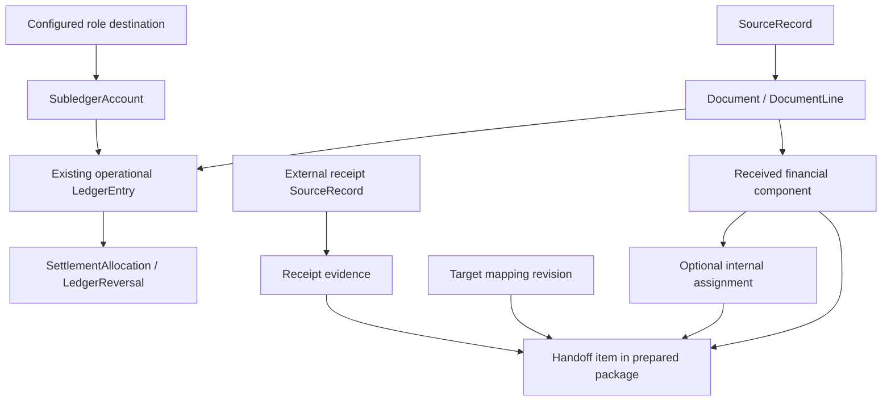

# Internal Structure: Subledgers and Accounting Handoff

**Design companion**: [data-model.md](data-model.md) now specifies the proposed physical schema; [plan.md](plan.md) records integration and rollout decisions. References below to later planning describe the original concept-stage boundary, now resolved in those artifacts.

**Status**: Proposed domain contract, not an approved physical schema.  
**Feature**: [148](spec.md)

## Ownership and existing model

Retain SourceRecord, Document/DocumentLine, LedgerEntry, LedgerReversal and SettlementAllocation. Introduce a minimal SubledgerAccount catalog to validate allowed local accounts. Existing operational roles remain the semantic contract; services resolve them through stable account identity rather than treating human account strings as logic. This feature does not introduce statutory account-category/report classification, FiscalPeriod, a general ledger or an accounting opening-balance model.

Existing `sales_revenue` gross amounts remain operational gross-account movements; `inventory` financial counterpart entries are not independently valued inventory. Presentation and handoff must preserve those meanings even where historical technical names are retained.

Arrows express relationships, not all required foreign keys. Ledger history and remote receipt history are different authorities. A destination saying posted does not create another local LedgerEntry.

## Proposed concepts and minimal fields

Every business record uses opaque ID and tenant scope. Code strings and remote IDs are references within a declared namespace, never local identity. Later planning must reuse existing source/proposal/job/artifact facilities before creating new tables.

| Concept | Proposed information | Proven use |
|---|---|---|
| SubledgerAccount | Stable ID, code, name, operational role, active/blocked | Enforce allowed destinations and role-based reads |
| Role destination | Operational role and one configured local account ID | Deterministic normal event posting without guessing among accounts |
| Received financial component | Evidence owner, source component identity/path, role, nullable stated net/tax/gross/base, currency, stated tax/account/center codes | Preserve and validate the exact amount/coding information handed off |
| CostCenterReference | Code, name, active/retired | Optional local lookup, filtering and historical interpretation |
| Assignment revision | Component reference, center, explicit assigned amount/basis, author, reason, revision | Explain internal responsibility without changing source or ledger amounts |
| Accounting target | Name, external-system namespace, profile identity/revision, enabled state | Scope mappings/receipts and distinguish target requirements |
| Mapping revision | Target, source/local reference and explicit external destination reference | Translate declared identifiers, not calculate tax or choose statutory treatment |
| Handoff package | Target/profile revision, prepared time, actor/request identity, immutable payload/artifact reference, manifest | Reproducible selected output and safe repeat download |
| Handoff item | Package, exact evidence version, stable target business-effect identity, correction relation and frozen assignment/mapping references | Item-level deduplication, explanation and outcome matching |
| Receipt evidence | Own SourceRecord, target/item/version reference if matched, source-stated outcome/time/external posting ID/reason | Prove exactly what the external system confirms |
| Recording authority/outcome | Source/type/revision scope, owner authority; business-effect identity and existing result reference | Bounded automation and durable recovery |

A component has exactly one document or document-line owner. Line components reach the document through their line. Document summaries retain their role and must not be counted again as line amounts. A missing numeric value is nullable, distinct from zero. Original textual representations remain in lossless payloads.

## Minimal subledger accounts

SubledgerAccount has `id`, `tenant_id`, `code`, `name`, `operational_role` and active/blocked state. Roles cover the current financial service purposes: receivable, payable, cash/payment and the supported gross operational counterpart meanings. The later plan must inventory the exact current role vocabulary instead of collapsing unlike counterpart semantics into one generic bucket. Roles are a bounded domain contract, not user-programmable accounting rules.

Many accounts may share a role; a tenant has one explicitly configured default destination per required role. The existing minimal account set supplies the first reviewed defaults. A caller may select a compatible active account where the operation supports selection. Invoice-bound control legs use the existing invoice account first; different-account use requires the explicit reclassification contract, never a default override. Missing/blocked defaults produce a review case, never fallback to an arbitrary account or create a new one. No tax-contingent operational posting-rule engine is added. Separate case/group-based handoff mappings are defined in [posting-matrix.md](posting-matrix.md).

A normal LedgerEntry references its local account by opaque ID. Its role is read from that account, not inferred from code/name. The legacy account string is removed in the clean local cutover; account_id is required. The plan must update role-based balance, duplicate-posting, credit and allocation discovery together, ensuring queries cover every matching account after defaults change. Settlement continues to use original entry identities.

Used accounts cannot be deleted or have an established role reassigned. Renaming or changing a code preserves identity and has audit context. Blocking disables new normal postings; an exact inverse may use the original blocked account and original dimensions. A separately reviewed replacement requires current active accounts. Role/default/eligibility validation and writes must serialize with account maintenance or equivalent revision checks so a stale preview cannot bypass a block.

Owner-only setup can create the minimal operational accounts without creating financial entries. Selected external account references may be imported through a bounded preview: code/name are supplied values, role is explicitly selected or already established by a reviewed mapping. Collisions and unknown roles require review. No automatic inference from a statutory account number is allowed. New accounts require a supported explicit role; no unresolved-role state is needed.

External account references belong to the existing target-specific Mapping revision concept and reference the local account ID. Different targets may use different account numbers; mapping is optional for local operation and frozen for each prepared package. A gross operational counterpart remains gross even if someone maps it to an external revenue code. Handoff must preserve its basis and must not generate an assumed net journal from that mapping.

## Cost assignment versus ledger dimensions

The earlier general-ledger draft assigned cost centers to split financial booking lines. This revised scope uses a narrower relationship: optional attribution of an actual received component. For a EUR 1,190 gross invoice stating EUR 1,000 net and EUR 190 tax, assign net 600/400 to centers while leaving the existing gross payable/counterpart entries intact.

The operational journal may display related assignment information through that evidence link, but must not imply the entire gross ledger line belongs to each center. No duplicate `cost_center_id` is added to every ledger line for this convenience. A future externally supplied journal-line dimension would be its own evidenced assertion and use case.

Each confirmed assignment revision identifies one received component/basis/currency and its explicit allocations. Partial attribution is allowed: a 600 assignment leaves 400 unassigned on a stated 1,000 base. Over-assignment, mixed bases or currencies are refused. Missing net is not reconstructed from gross. Source-stated center codes and internally chosen centers remain visibly different. Retirement prevents new selection but preserves history; correcting a prepared assignment creates a new revision rather than changing a package.

## Declared case and coding-group structure

The detailed contract is [posting-matrix.md](posting-matrix.md). CaseCode and optional CodingGroup have opaque tenant IDs, unique codes, descriptions and active/retired state. Source-code mappings are scoped to the source namespace. Component assignment revisions preserve the original source assertion separately from any confirmed internal assignment and reason; no parent document/line link is duplicated where the component supplies it.

Target mapping revisions add transaction kind, CaseCode reference, group discrimination mode/optional CodingGroup reference and external account/tax-code destinations. These fields are justified by exact filtering/joins and unique-match constraints. The active resolution mode for each target/transaction/case scope is explicit, preventing a broad mapping from silently competing with a group-specific one. Prepared items retain exact selected assignment/mapping revisions. No calculated tax, country eligibility rule or new financial authority is stored.

## Target mappings and package semantics

No imported complete financial chart is required; local account eligibility is governed by the small subledger catalog above. V1 mapping includes declared case/group resolution under posting-matrix.md and explicit reference translation for a selected target, such as a supplied source expense code to an external account reference, or a local cost-center ID to a target center code. A mapping does not determine the financial correctness of a tax code or become a posting rule engine.

The neutral V1 profile is a versioned machine-readable JSON package with a manifest and item records. A tabular human preview is read from the same data. It includes:

- Target/profile/version and preparation identity/time.
- Stable item/effect identities, source/evidence versions and document kind/reference/date.
- Currency and source-stated amounts/components, including nulls and their basis/role.
- Source-stated coding and separate reviewed internal/external-reference annotations.
- Links/identities of local operational records where held, explicitly labelled gross operational postings.
- Original/correction relationships and required missing information/omissions.

Only ready selected items enter a confirmed package; excluded/unready selections are shown with reasons before confirmation and require an explicit corrected selection. A neutral package can carry gross-only evidence and declared omissions. A stricter future target profile may require net/tax or codes; its missing fields block handoff readiness, not otherwise valid local recording.

Packages are immutable artifacts. Repeating the same confirmed request returns the same package. Repackaging the same item for the same target retains its business-effect identity, exposes earlier packages and requires explicit retry/correction intent. Creating a file is no evidence of delivery; neutral packages do not guarantee that a receiving vendor enforces these identities.

## Receipt evidence and independent state axes

Local recording: not recorded / recorded / reversed, derived from existing records and review outcomes.

Preparation: no package / prepared version(s), supported by immutable package facts.

External facts: delivered / accepted / rejected / posted, only where external source evidence explicitly asserts that meaning for a target item/version. These are not a forced linear state machine. Posted may arrive without a delivered event; a late receipt for an older version must not label a newer version posted.

Unknown, unmatched or contradictory receipts remain available with an explanation and resolution work. Never select whichever status appears most advanced merely to hide conflict. A batch success means no more than the source explicitly states; item-level posting cannot be inferred from generic batch acceptance. An operator note is an internal assertion, not a source-backed external posting confirmation.

V1 imports receipts via the existing lossless source/interpretation path and a neutral receipt contract; no network sender or new credential store is included. The later plan must define exact receipt identifiers, deduplication and permitted source outcome vocabulary. Durable receipts remain independent of export download tracking.

## Automation and consistency

Use existing shared posting services for supported financial types, with narrowly enabled automatic recording. Source intake authorization never approves this downstream effect. Owner permission, source/type/contract revision and current enabled state are checked at execution. Ordinary Chat/MCP proposals still require their own confirmation.

Successful interpretation must commit recoverable recording eligibility with its evidence; the later plan chooses the existing event/job mechanism without a crash gap. Recording group, effect identity and completion commit atomically. Retry preserves identity. New source versions or interpretation rules cannot create another original for a recorded effect. Corrections use the existing review/reversal flow.

Do not expand automatic recording to unsupported interpreter targets. The plan must inventory which financial evidence paths actually exist and add only the bounded supported translations with tests. All queues/handlers use the shared registry; no direct external effects are authorized here.

## Adoption and read models

Use the owner-approved clean local schema and regenerated disposable fixtures. Remove the old account string instead of backfilling it; keep no compatibility column or unresolved account state. New-model history remains immutable. The separately specified operational opening-item import still carries externally stated outstanding positions and is not removed by this development simplification.

Operational readiness, handoff readiness and external outcome summaries derive from the relevant evidence and records. No `accounting_status`, `transferred` or `posted_externally` field is added to Document. No stored profit, tax calculation or alternate open balance is introduced.

Read totals keep currency and amount basis separate and cover all matching rows before pagination. Assignment analysis uses components, not repeated whole-document ledger amounts. Handoff reconciliation compares compatible asserted facts; no remote account balance is invented from locally exported items.

Exact schema, migration/rollback and API shapes are later plan decisions, with catalog/isolation/Inspector updates and PostgreSQL tests required.

## Explicit customer/supplier settlement reductions and excess cash

[payment-differences.md](payment-differences.md) defines the added operation. Reuse LedgerEntry, LedgerReversal and SettlementAllocation for separate cash and non-cash groups. Add only the minimum immutable internal adjustment evidence (stated amount/currency, invoice/party context, reason category/text, author/confirmation, optional source advice) and a permitted adjustment counterpart role. A dedicated internal evidence kind is a later schema decision, not a fake external credit note. Claimed withholding notes do not own a balance. Unallocated customer credit derives from payment control entries minus effective allocations, not a new credit table.

Extend settlement discovery where necessary for the new evidence kind and refund-from-payment-credit wrapper. Validate same tenant, party, currency and current availability across every path. An accepted adjustment must be recognized as the same effect if later credit/external evidence arrives; do not consume the claim twice. Tax/net breakdown is retained only when stated and is not derived from a gross concession.

Supplier parity adds direction to settlement-adjustment evidence and a distinct supplier-reduction counterpart role; supplier agreement/entitlement must be recorded separately from our claimed deduction. Reuse the same ledger, allocation and reversal foundations with the opposite payable control direction. The customer and supplier actions may share internal validation but expose explicit supported operation kinds and evidence, not a caller-controlled sign switch.

V09 Available credits derives per-side/party/currency availability from eligible payment and credit-note control entries minus effective allocations. Origin identities are preserved; no credit balance table or generic customer/supplier net balance is added. Reversed/inverse entries and invoice-linked settlement reductions are excluded as spendable origins. Multi-origin allocation/refund must lock/revalidate all origins consistently, and every read/command remains tenant scoped. Current supplier credit-note/refund discovery is extended only where payment-origin credits need the new wrapper.

## Opening subledger evidence and coverage

[opening-items.md](opening-items.md) defines the approved four-direction import. Add only the minimum opening evidence kind/direction, source item/cutover/coverage identity and neutral operational counterpart role needed to use existing LedgerEntry and SettlementAllocation. The stated amount is the open residual at cutover, not reconstructed invoice total. Original due date is optional and never fabricated. Existing local records remain unchanged.

V09 includes opening-credit control entries once alongside payment/credit-note origins; opening neutral counterparts are never available credit. Extend settlement discovery/refund wrappers to those explicit origins. Summary/detail overlap and historical backfill need retained scope evidence and refusal/review, not a new computed balance authority. Confirmed imports are immutable and corrections use existing reversal/effective-allocation semantics with explicit downstream reallocation.

## Trade-finance control additions

[trade-finance-controls.md](trade-finance-controls.md) defines the minimum new concepts and their field use cases: money-account purpose plus explicit statement-line/economic-event matches; source-backed provider reserve/dispute/transfer events; bounded AdvanceAssignment linking payment control entry to intended order; auditable PaymentHold linked to payable item; and relationship/coverage assertions distinguishing linked/not-applicable/unknown. Reuse existing SourceRecord, DocumentLine, LedgerEntry, allocation and decision primitives. Every business concept is tenant scoped; values repeatedly used for availability/eligibility/joins are typed only for these proved cases.

Keep settlement on opposite sides of the same concrete account. The explicitly reviewed cross-account control reclassification and paired allocations conserve role balance and credit availability; do not replace account identity validation with role equality. The history of reclassification is evidence and ledger entries, not an alternate mutable balance.

Money-account purposes distinguish bank/cash from PSP clearing, restricted/disputed provider assets and transfer-in-transit; actual source event semantics govern posting. Source matching does not invent fees, exchange amounts or capture completion. No stored provider balance or advance balance is added. Disposable projections derive them and expose coverage.

[agent-finance-contract.md](agent-finance-contract.md) fixes the Fact boundary: existing typed Reality, source evidence, internal decisions and derived observations retain their own authority. No new financial Fact predicates are required by default and no paid/balance/hold-derived Fact duplicates are allowed. Current known state, declared source coverage and historical event chronology remain distinct.
